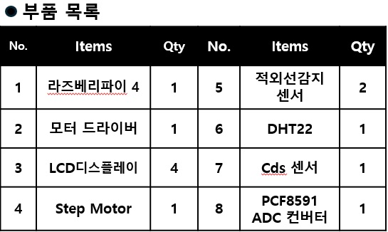

## Team-Project_Smart_Sunroof

### 1. 목적
- 스마트 썬루프를 제작을 통한 라즈베리파이,Step Motor, 적외선센서, LCD 디스플레이 조작 및 이해

### 2. 프로젝트의 목표
- 기능별 캡슐화로 모듈성 향상 및 유지보수 용이성 확보
- Step Motor를 통한 썬루프 제어 구현
- 적외선 센서를 이용한 썬루프 위치 통제
- LCD 디스플레이를 통해 실시간 온습도 확인

### 3. 부품

  

### 4. Hardware/System Diagram

  
    
  

### 5. 프로젝트 구현

  

  

